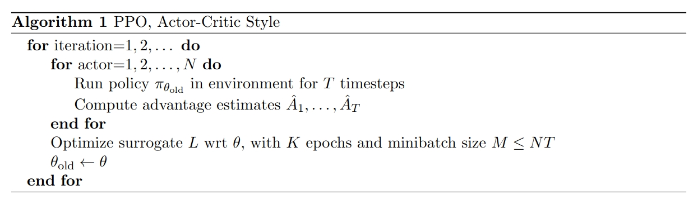

# Proximal Policy Optimization with Clipped Objective（PPO-Clip）
**论文链接：** [**arxiv**](https://arxiv.org/pdf/1707.06347)

**近端策略优化（Proximal Policy Optimization，PPO）** 算法由 **John Schulman** 于 2017 年在 OpenAI 提出。他也是 **信赖域策略优化（Trust Region Policy Optimization，TRPO）** 的第一作者，此前于加州大学伯克利分校获得博士学位。  
与 TRPO 相比，PPO 保留了限制策略更新步幅这一核心思想，同时显著降低了实现复杂度。TRPO 的计算复杂度较高，尤其是在计算 Hessian 矩阵以及执行二阶优化时，因此不适合计算资源有限的场景。  
PPO 建立在 TRPO 的思想基础上，但实现更加简单。大量实验结果表明，PPO 的学习效果与 TRPO 相当，甚至收敛更快，因此成为了一种非常流行的强化学习算法。

下表列出了 **PPO** 算法的一些基本特征：

| PPO 的特征            | 是否具备 | 说明 |
|--------------------|----------|------|
| On-policy（同策略）     | ✅ | 行为策略与目标策略相同。 |
| Off-policy（异策略）    | ❌ | 行为策略与目标策略不同。 |
| Model-free（无模型）    | ✅ | 不需要预先构建环境动力学模型。 |
| Model-based（基于模型）  | ❌ | 需要利用环境模型训练策略。 |
| 离散动作               | ✅ | 可以处理离散动作空间。 |
| 连续动作               | ✅ | 可以处理连续动作空间。 |

*原论文提出了 PPO 的两个主要变体：PPO-KL 和 PPO-Clip。实验发现，PPO-Clip 具有更好的性能和稳定性，因此后续绝大多数 PPO 实现都采用了裁剪代理目标（Clipped Surrogate Objective）。本节主要介绍 PPO-Clip。*


## TRPO

由于 PPO 是在 TRPO 的基础上提出的改进算法，为了更深入地理解 PPO 的基本原理，有必要首先分析 TRPO 的核心思想。

TRPO 最初由 John Schulman 等人于 2015 年发表的论文 [**Trust Region Policy Optimization**](https://proceedings.mlr.press/v37/schulman15.pdf) 中提出。  
该论文引入了**信赖域（trust region）和 KL 散度约束**的概念。其核心思想是在信赖域内更新策略，从而为策略性能提供一定的安全保证。  
TRPO 描述了一种迭代优化策略的方法，在理论上能够保证策略学习性能单调提升，并且在实际应用中取得了优于传统策略梯度算法的效果。

### 目标函数的单调性保证

TRPO 指出了新旧策略目标函数之间的差异：

$$
\begin{aligned}
J(\theta^{\prime})-J(\theta) & =\mathbb{E}_{\pi}\left[V^{\pi_{\theta^{\prime}}}(s_0)\right]-\mathbb{E}_{\pi}\left[V^{\pi_\theta}(s_0)\right] \\
 & =\mathbb{E}_{\pi_{\theta^{\prime}}}\left[\sum_{t=0}^\infty\gamma^tr(s_t,a_t)\right]+\mathbb{E}_{\pi_{\theta^{\prime}}}\left[\sum_{t=0}^\infty\gamma^t\left(\gamma V^{\pi_\theta}(s_{t+1})-V^{\pi_\theta}(s_t)\right)\right] \\
 & =\mathbb{E}_{\pi_{\theta^{\prime}}}\left[\sum_{t=0}^\infty\gamma^t\left[r(s_t,a_t)+\gamma V^{\pi_\theta}(s_{t+1})-V^{\pi_\theta}(s_t)\right]\right]
\end{aligned}
$$

将 TD 残差形式转换为优势函数 $A^{\pi_\theta}$：

$$
J(\theta^{\prime})-J(\theta)=\mathbb{E}_{\pi_{\theta^{\prime}}}\left[\sum_{t=0}^\infty\gamma^tA^{\pi_\theta}(s_t,a_t)\right]
$$

进一步展开为期望形式：

$$
J(\theta^{\prime})-J(\theta)=\sum_\tau\left[p(\tau|\pi_{\theta^{\prime}})\sum_{t=0}^\infty\gamma^tA^{\pi_\theta}(s_t,a_t)\right]
$$

- 轨迹概率：$p(\tau|\theta)=p(s_0)\prod_{t=0}^{T}[\pi_\theta(a_t|s_t)p(s_{t+1}|s_t,a_t)]$

由于状态访问分布定义为  
$\nu^\pi(s)=(1-\gamma)\sum_{t=0}^\infty\gamma^tP(s_t = s, a_t = a \| \pi)$，  
因此，上式可以进一步表示为状态访问概率分布的形式：

$$
J(\theta^{\prime})-J(\theta) = \frac{1}{1 - \gamma} \sum_{s} \left[ \nu^{\pi_{\theta'}}(s) \sum_{a} \left[ \pi_{\theta'}(a | s)   A^{\pi_\theta}(s, a)  \right] \right]
$$

因此，只需保证：

$$
\sum_{s} \left[ \nu^{\pi_{\theta'}}(s) \sum_{a} \left[ \pi_{\theta'}(a | s)   A^{\pi_\theta}(s, a)  \right] \right] \geq 0
$$

- 该条件可以保证策略性能单调提升。

然而，为了获得状态访问分布而从所有可能的新策略中采样数据，再评估哪些新策略满足上述条件，显然是不现实的。  
TRPO 通过一个近似步骤解决该问题：忽略新旧策略之间状态访问分布的变化，直接使用旧策略的状态分布 $\nu^{\pi_{\theta}}(s)$：

$$
J(\theta^{\prime})-J(\theta) = \frac{1}{1 - \gamma} \sum_{s} \left[ \nu^{\pi_{\theta}}(s) \sum_{a} \left[ \pi_{\theta'}(a | s)   A^{\pi_\theta}(s, a)  \right] \right]
$$

- 当新旧策略非常接近时，状态访问分布的变化较小，因此这一近似是合理的。

由此可定义如下**优化目标**：

$$
\begin{aligned}
L_\theta(\theta^{\prime})& =J(\theta)+\frac{1}{1 - \gamma} \sum_{s} \left[ \nu^{\pi_{\theta}}(s) \sum_{a} \left[ \pi_{\theta'}(a | s)   A^{\pi_\theta}(s, a)  \right] \right] \\
& =J(\theta)+\frac{1}{1 - \gamma} \sum_{s} \left[ \nu^{\pi_{\theta}}(s) \sum_{a}\pi_{\theta}(a | s) \left[    \frac{\pi_{\theta^{\prime}}(a|s)}{\pi_\theta(a|s)}A^{\pi_\theta}(s,a) \right] \right] \\
& =J(\theta)+\mathbb{E}_{s\sim\nu^{\pi_\theta}}\mathbb{E}_{a\sim\pi_\theta(\cdot|s)}\left[\frac{\pi_{\theta^{\prime}}(a|s)}{\pi_\theta(a|s)}A^{\pi_\theta}(s,a)\right]
\end{aligned}
$$

### 对策略更新幅度的约束

在 TRPO 中，使用 **KL 散度**限制每次策略更新的幅度，从而确保新策略与旧策略之间的差异不会过大，以维持优化过程的稳定性。  
具体来说，TRPO 在每次策略更新时引入如下基于 KL 散度的约束：

$$
\sum_s\nu^{\pi_\theta}(s)\mathrm{KL}\left[\pi_\theta(\cdot|s)||\pi_{\theta^{\prime}}(\cdot|s)\right]=\mathbb{E}_{s\sim\nu^{\pi_\theta}} \left[ \text{KL} \left( \pi_\theta(\cdot | s) || \pi_{\theta'}(\cdot | s) \right) \right] \leq \delta
$$

- **$\delta$**：新旧策略差异的上界约束。

上述不等式约束在策略空间中定义了一个“KL 球”，该区域被称为**信赖域**。  
在该区域内，可以认为当前策略与环境交互所产生的状态分布，与上一轮旧策略采样得到的状态分布近似一致，从而使当前策略能够稳定改进。


## PPO-Clip

TRPO 使用泰勒展开近似、共轭梯度和线搜索等方法，直接求解以下约束优化问题：

$$
\begin{aligned}
\max_{\theta} \quad & \mathbb{E}_{s\sim\nu^{\pi_{\theta_k}}}\mathbb{E}_{a\sim\pi_{\theta_k}(\cdot|s)}\left[\frac{\pi_{\theta^{\prime}}(a|s)}{\pi_{\theta_k}(a|s)} A^{\pi_{\theta_k}}(s,a)\right] \\
\text{subject to} \quad & \mathbb{E}_{s\sim\nu^{\pi_{\theta_k}}} \left[ D_{KL} \left( \pi_{\theta_k}(\cdot|s), \pi_{\theta^{\prime}}(\cdot|s) \right) \right] \leq \delta
\end{aligned}
$$

- 然而，TRPO 的计算复杂度相对较高，尤其涉及 Hessian 矩阵计算和二阶优化时。

相比之下，PPO 采用了更简单、高效的方法实现限制策略更新幅度这一目标。

这些方法主要包括两种形式：**裁剪代理目标（Clipped Surrogate Objective）和自适应 KL 惩罚（Adaptive KL Penalty）**。

下面主要介绍**裁剪代理目标**。

### 裁剪代理目标

**PPO-Clip** 是 PPO 中最常用的方法。它在大多数任务中均能取得良好的性能，同时实现起来更加简单、高效。  
PPO-Clip 通过引入裁剪机制约束策略更新幅度：

$$
\arg\max_{\theta}\mathbb{E}_{s\sim\nu^{\pi_{\theta_k}}}\mathbb{E}_{a\sim\pi_{\theta_k}(\cdot|s)}\left[\min\left(\frac{\pi_\theta(a|s)}{\pi_{\theta_k}(a|s)}A^{\pi_{\theta_k}}(s,a) , \operatorname{clip}\left(\frac{\pi_\theta(a|s)}{\pi_{\theta_k}(a|s)},1-\epsilon,1+\epsilon\right)A^{\pi_{\theta_k}}(s,a)\right)\right]
$$

- $\epsilon$ 是一个较小的常数，例如 0.1 或 0.2，用于控制裁剪范围。
- $\operatorname{clip}(x,l,r)$：将 $x$ 限制在区间 $[l,r]$ 内。

当 $A^{\pi_{\theta_k}}(s, a) > 0$ 时，说明该动作的价值高于平均水平。最大化上述表达式会增大概率比值 $\frac{\pi_\theta(a|s)}{\pi_{\theta_k}(a|s)}$，但由裁剪项带来的收益不会超过 $1+\epsilon$ 所对应的范围。  
当 $A^{\pi_{\theta_k}}(s, a) < 0$ 时，最大化上述表达式会减小概率比值 $\frac{\pi_\theta(a|s)}{\pi_{\theta_k}(a|s)}$，但由裁剪项带来的收益不会低于 $1-\epsilon$ 所对应的范围。  
这种机制能够抑制幅度过大的策略更新，从而提高训练稳定性。

可以看出，PPO-Clip 不再直接使用 KL 散度约束，而是以裁剪机制作为替代。其目标函数可以写为：

$$
L^{\mathrm{clip}}(\theta)=\mathbb{E}_t\left[\min\left(r_t(\theta)\hat{A}_t,\mathrm{clip}(r_t(\theta),1-\epsilon,1+\epsilon)\hat{A}_t\right)\right]
$$

- $r_t(\theta)$：当前策略与旧策略之间的概率比值：

$$
r_t(\theta)=\frac{\pi_\theta(a_t|s_t)}{\pi_{\theta_\mathrm{old}}(a_t|s_t)}
$$

- 裁剪目标函数通过限制 $r_t(\theta)$ 的作用范围来控制策略更新。


## 算法

下面给出了一个使用固定长度轨迹片段的近端策略优化（PPO）算法：

  

**算法 1：** 在每次迭代中，$N$ 个并行 Actor 分别收集 $T$ 个时间步的交互数据。随后，基于汇总后的 $N\times T$ 个时间步数据构造代理损失，并使用小批量随机梯度下降（SGD）优化 $K$ 个轮次（epoch）。

## 在 XuanCe 中运行 PPO

在 XuanCe 中运行 **PPO** 之前，需要先准备 Conda 环境，并按照[**安装步骤**](./../../usage/installation.rst#id2)安装 ``xuance``。

### 运行内置示例

完成安装后，可以打开 Python 控制台，并使用以下命令直接运行 **PPO**：

```python3
import xuance
runner = xuance.get_runner(algo='ppo',  # 选择算法名称。
                           env='classic_control',  # 可选：classic_control、box2d、atari 等。
                           env_id='CartPole-v1',  # 可选：CartPole-v1、Pendulum-v1 等。
                           )
runner.run()  # 或者使用 runner.benchmark()
```

### 使用自定义配置运行

若希望使用不同的配置运行 **PPO**，例如在 PPO 和 PPO_KL 之间进行选择，或者修改其他配置，可以新建一个 ``.yaml`` 文件，例如 ``my_config.yaml``。  
随后，通过以下代码运行 **PPO**：

```python3
import xuance
runner = xuance.get_runner(algo='ppo',
                           env='classic_control',  # 可选：classic_control、box2d、atari 等。
                           env_id='CartPole-v1',  # 可选：CartPole-v1、Pendulum-v1 等。
                           config_path="my_config.yaml",  # 请确保 my_config.yaml 的路径正确。
                           )
runner.run()  # 或者使用 runner.benchmark()
```

若要进一步了解配置方法，请参阅[**配置教程**](./../../api/configs/configuration_examples.rst)。

### 在自定义环境中运行

如果希望在 XuanCe 尚未内置的自定义环境中运行 **PPO**，需要按照[**新环境教程**](./../../usage/custom_env/custom_drl_env.rst)中的步骤定义新环境。  
随后，[**准备配置文件**](./../../usage/custom_env/custom_drl_env.rst#step-2-create-the-config-file-and-read-the-configurations) ``ppo_myenv.yaml``。

完成上述步骤后，可以使用以下代码在自定义环境中运行 **PPO**：

```python3
import argparse
from xuance.common import load_yaml
from xuance.environment import REGISTRY_ENV
from xuance.environment import make_envs
from xuance.torch.agents import PPO_Agent

configs_dict = load_yaml(file_dir="ppo_myenv.yaml")
configs = argparse.Namespace(**configs_dict)
REGISTRY_ENV[configs.env_name] = MyNewEnv

envs = make_envs(configs)  # 创建并行环境。
Agent = PPO_Agent(config=configs, envs=envs)  # 创建 XuanCe PPO 智能体。
Agent.train(configs.running_steps // configs.parallels)  # 训练指定数量的步数。
Agent.save_model("final_train_model.pth")  # 将模型保存到 model_dir。
Agent.finish()  # 结束训练并释放相关资源。
```

## 引用

```{code-block} bash
@article{schulman2017proximal,
  title={Proximal policy optimization algorithms},
  author={Schulman, John and Wolski, Filip and Dhariwal, Prafulla and Radford, Alec and Klimov, Oleg},
  journal={arXiv preprint arXiv:1707.06347},
  year={2017}
}
```
