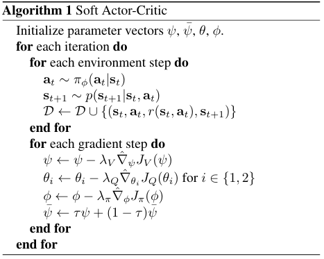

# 软演员—评论家算法（SAC）

**论文链接：[arXiv](https://arxiv.org/abs/1802.09477)**。

软演员—评论家算法（Soft Actor-Critic，SAC）是一种先进的无模型深度强化学习算法，它将演员—评论家框架与最大熵强化学习原理相结合。SAC 于 2018 年提出，凭借其处理连续动作空间的能力，以及在多种复杂任务中的稳定表现，受到了广泛关注。

下表列出了 SAC 算法的一些基本特征：

| SAC 的特征           | 是否具备 | 说明             |
|-------------------|------|----------------|
| 同策略（On-policy）    | ❌    | 评估策略与目标策略相同。   |
| 异策略（Off-policy）   | ✅    | 评估策略与目标策略不同。   |
| 无模型（Model-free）   | ✅    | 无须预先构建环境动力学模型。 |
| 基于模型（Model-based） | ❌    | 需要使用环境模型训练策略。  |
| 离散动作              | ✅    | 可处理离散动作空间。     |
| 连续动作              | ✅    | 可处理连续动作空间。     |

## SAC 的核心思想

**基于最大熵的目标函数：**

传统强化学习的目标是最大化期望奖励之和。相比之下，SAC 采用的最大熵强化学习目标为：

$$
J(\pi) = \sum_{t=0}^{T} \mathbb{E}_{(s_t, a_t) \sim \rho_{\pi}} \left[ r(s_t, a_t) + \alpha \mathcal{H}(\pi(\cdot | s_t)) \right]
$$

其中：

- $\mathcal{H}(\pi(\cdot|s_t))$ 表示策略 $\pi$ 在状态 $s_t$ 下的熵；
- $\alpha$ 是控制熵项重要程度的超参数。

该目标函数引入了 $\alpha\mathcal{H}(\pi(\cdot|s_t))$ 熵项，鼓励智能体在追求高奖励的同时保持一定程度的随机性，从而增强探索能力。温度参数 $\alpha$ 决定熵项相对于奖励项的重要程度，并控制最优策略的随机程度。当 $\alpha=0$ 时，该目标退化为传统的最大期望回报目标。这样的目标设计使智能体能够在复杂环境中探索多种行为模式，并找到更优的策略。

**双 Q 网络设计：**

为减轻 Q 值的过估计问题，SAC 使用两个评论家网络。每个评论家网络分别估计状态—动作对的价值，并使用两个 Q 值中的较小值计算目标 Q 值。该设计能够有效降低 Q 值估计偏差，并提高算法的稳定性。

**软更新机制：**

SAC 使用软更新机制更新目标网络，以提高训练稳定性。具体而言，目标网络参数按照以下方式更新：

$$
\theta_{\text{target}} \leftarrow \tau \theta + (1 - \tau) \theta_{\text{target}}
$$

其中，$\tau$ 是一个较小的正数，通常取 0.005。软更新机制能够平滑目标网络的参数更新，避免目标网络参数发生剧烈变化。

## 算法

训练 SAC 的完整算法如算法 1 所示：



**补充说明：** TD3 和 SAC 在多个方面具有相似性，包括网络结构、双 Q 网络设计、软更新机制、训练稳定性、适用场景、实现特点、优化目标和实际应用价值。这些相似性使二者在处理连续动作空间任务时都能取得良好表现。不过，它们在探索机制和策略类型方面存在差异，因此在不同任务中的适用性和性能也有所不同。

参阅 [TD3](./td3.md) 算法。

## 在 XuanCe 中运行 SAC

在 XuanCe 中运行 SAC 之前，需要先准备一个 conda 环境，并按照
[**安装步骤**](./../../usage/installation.rst)安装 ```xuance```。

### 运行内置示例

完成安装后，可以打开 Python 控制台，并使用以下命令直接运行 SAC：

```python3
import xuance
runner = xuance.get_runner(method='SAC',
                           env='classic_control',  # 可选项：classic_control、box2d、atari。
                           env_id='Pendulum-v1',
                           is_test=False)
runner.run()  # 也可以使用 runner.benchmark()
```

### 使用自定义配置运行

如需使用不同配置运行 SAC，可以新建一个 ```.yaml``` 文件，例如
```my_config.yaml```。然后使用以下代码运行 SAC：

```python3
import xuance as xp
runner = xp.get_runner(method='SAC',
                       env='classic_control',  # 可选项：classic_control、box2d 等。
                       env_id='Pendulum-v1',
                       config_path="my_config.yaml",  # 请确保 my_config.yaml 文件的路径正确。
                       is_test=False)
runner.run()  # 也可以使用 runner.benchmark()
```

如需进一步了解配置方法，请参阅
[**配置教程**](./../../api/configs/configuration_examples.rst)。

### 在自定义环境中运行

如需在 XuanCe 尚未包含的自定义环境中运行 SAC，需要按照
[**新环境教程**](./../../usage/custom_env/custom_drl_env.rst)
中的步骤定义新环境。
然后，[**准备配置文件**](./../../usage/custom_env/custom_drl_env.rst#step-2-create-the-config-file-and-read-the-configurations)
```SAC_myenv.yaml```。

完成上述操作后，可以使用以下代码在自定义环境中运行 SAC：

```python3
import argparse
from xuance.common import get_configs
from xuance.environment import REGISTRY_ENV
from xuance.environment import make_envs
from xuance.torch.agents import SAC_Agent

configs_dict = get_configs(file_dir="SAC_myenv.yaml")
configs = argparse.Namespace(**configs_dict)
REGISTRY_ENV[configs.env_name] = MyNewEnv

envs = make_envs(configs)  # 创建并行环境。
Agent = SAC_Agent(config=configs, envs=envs)  # 创建一个来自 XuanCe 的 SAC 智能体。
Agent.train(configs.running_steps // configs.parallels)  # 对模型进行多个步骤的训练。
Agent.save_model("final_train_model.pth")  # 将模型保存到 model_dir。
Agent.finish()  # 结束训练。
```

## 参考文献

```{code-block} bash
@inproceedings{haarnoja2018soft,
  title={Soft actor-critic: Off-policy maximum entropy deep reinforcement learning with a stochastic actor},
  author={Haarnoja, Tuomas and Zhou, Aurick and Abbeel, Pieter and Levine, Sergey},
  booktitle={International conference on machine learning},
  pages={1861--1870},
  year={2018},
  organization={PMLR}
}
```
