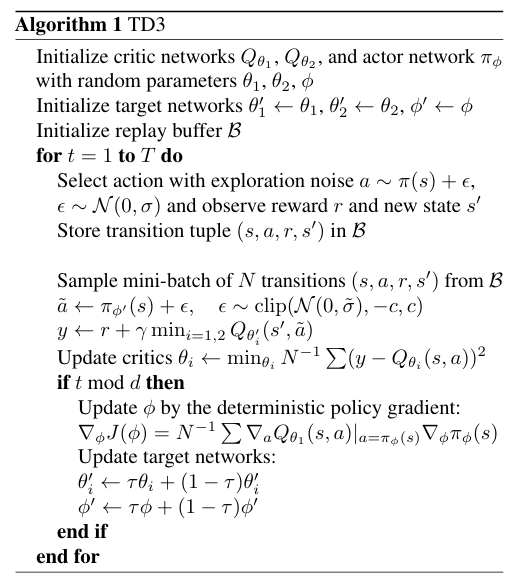

# 双延迟深度确定性策略梯度算法（TD3）

**算法全称**: Twin Delayed Deep Deterministic (TD3) policy gradient

**论文链接：[https://arxiv.org/abs/1802.09477](https://arxiv.org/abs/1802.09477)**

双延迟深度确定性策略梯度算法（Twin Delayed Deep Deterministic Policy Gradient，TD3）是深度确定性策略梯度（DDPG）算法的一种改进方法，旨在缓解连续控制任务中的价值过估计问题。针对 DDPG 存在的部分缺陷，TD3 引入了三项关键改进：裁剪双 Q 学习（Clipped Double-Q Learning）、延迟策略更新（Delayed Policy Updates）和目标策略平滑（Target Policy Smoothing）。

下表列出了 TD3 算法的一些基本特征：

| TD3 的特征           | 是否具备 | 说明             |
|-------------------|------|----------------|
| 同策略（On-policy）    | ❌    | 评估策略与目标策略相同。   |
| 异策略（Off-policy）   | ✅    | 评估策略与目标策略不同。   |
| 无模型（Model-free）   | ✅    | 无须预先构建环境动力学模型。 |
| 基于模型（Model-based） | ❌    | 需要使用环境模型训练策略。  |
| 离散动作              | ❌    | 不直接处理离散动作空间。   |
| 连续动作              | ✅    | 可处理连续动作空间。     |

## 过估计风险

确定性策略梯度方法同样存在价值过估计问题。在演员—评论家框架中，策略通常变化较慢，因此当前价值估计与目标价值估计往往过于相似，难以像 Double DQN 那样通过解耦动作选择和动作评估来有效消除最大化偏差。因此，直接将 Double DQN 的方法应用于确定性演员—评论家算法，通常无法充分解决该问题。

## TD3 的核心思想

### 裁剪双 Q 学习

TD3 使用两个评论家网络 $Q_{\theta_1}$ 和 $Q_{\theta_2}$ 来减小过估计偏差。计算目标值时，取两个目标评论家网络估计值中的较小值：

$$
y = r + \gamma \min_{i=1,2}
Q_{\theta_i'}\left(s', \pi_{\phi'}(s')+\epsilon\right),
$$

其中：

$$
\epsilon \sim \operatorname{clip}\left(\mathcal{N}(0,\sigma),-c,c\right).
$$

这种方式使目标价值不会产生比标准 Q-learning 目标更严重的过估计，并可能带来一定程度的低估。由于被低估的动作价值不会像过估计值那样通过策略更新被显式放大，因此其负面影响通常更小。

### 延迟策略更新

考虑到目标网络能够减缓误差累积，而高方差的价值估计会对策略更新产生不利影响，TD3 降低了策略网络的更新频率。只有在评论家网络完成固定次数 $d$ 的更新后，才更新一次策略网络和目标网络。

目标网络仍采用软更新方式：

$$
\theta_i' \leftarrow \tau \theta_i + (1-\tau)\theta_i'.
$$

由于评论家网络的更新频率高于演员网络，策略更新时所依赖的价值估计通常更加准确，从而提升训练稳定性。

### 目标策略平滑正则化

确定性策略可能会过拟合价值函数估计中的狭窄尖峰。为缓解这一问题，TD3 引入目标策略平滑正则化。在更新评论家网络时，向目标策略生成的动作中加入经过裁剪的小幅随机噪声：

$$
y = r + \gamma \min_{i=1,2}
Q_{\theta_i'}\left(s',\pi_{\phi'}(s')+\epsilon\right),
$$

$$
\epsilon \sim \operatorname{clip}\left(\mathcal{N}(0,\sigma),-c,c\right).
$$

这种处理鼓励相近动作具有相近的价值，使评论家网络学习到更加平滑的价值函数，降低目标值的方差，并提升算法在随机环境和存在估计误差时的性能。

### 消融实验

论文通过消融实验分析了各个组成部分的贡献，包括裁剪双 Q 学习、延迟策略更新和目标策略平滑正则化。实验结果表明，在大多数任务中，仅加入单个组件带来的性能提升并不显著，而将多个组件组合使用后，算法性能能够得到明显改善。

## 算法

训练 TD3 的完整算法如算法 1 所示：



## 在 XuanCe 中运行 TD3

在 XuanCe 中运行 TD3 之前，需要先准备一个 conda 环境，并按照
[**安装步骤**](./../../usage/installation.rst)安装 ```xuance```。

### 运行内置示例

完成安装后，可以打开 Python 控制台，并使用以下命令直接运行 TD3：

```python3
import xuance
runner = xuance.get_runner(method='td3',
                           env='classic_control',  # 可选项：classic_control、box2d 等。
                           env_id='Pendulum-v1',  # 选择具有连续动作空间的环境。
                           is_test=False)
runner.run()  # 也可以使用 runner.benchmark()
```

### 使用自定义配置运行

如需使用不同配置运行 TD3，可以新建一个 ```.yaml``` 文件，例如
```my_config.yaml```。然后使用以下代码运行 TD3：

```python3
import xuance as xp
runner = xp.get_runner(method='td3',
                       env='classic_control',  # 可选项：classic_control、box2d 等。
                       env_id='Pendulum-v1',
                       config_path="my_config.yaml",  # 请确保 my_config.yaml 文件的路径正确。
                       is_test=False)
runner.run()  # 也可以使用 runner.benchmark()
```

如需进一步了解配置方法，请参阅
[**配置教程**](./../../api/configs/configuration_examples.rst)。

### 在自定义环境中运行

如需在 XuanCe 尚未包含的自定义环境中运行 TD3，需要按照
[**新环境教程**](./../../usage/custom_env/custom_drl_env.rst)
中的步骤定义新环境。
然后，[**准备配置文件**](./../../usage/custom_env/custom_drl_env.rst#step-2-create-the-config-file-and-read-the-configurations)
```td3_myenv.yaml```。

完成上述操作后，可以使用以下代码在自定义环境中运行 TD3：

```python3
import argparse
from xuance.common import get_configs
from xuance.environment import REGISTRY_ENV
from xuance.environment import make_envs
from xuance.torch.agents import TD3_Agent

configs_dict = get_configs(file_dir="td3_myenv.yaml")
configs = argparse.Namespace(**configs_dict)
REGISTRY_ENV[configs.env_name] = MyNewEnv

envs = make_envs(configs)  # 创建并行环境。
Agent = TD3_Agent(config=configs, envs=envs)  # 创建一个来自 XuanCe 的 TD3 智能体。
Agent.train(configs.running_steps // configs.parallels)  # 对模型进行多个步骤的训练。
Agent.save_model("final_train_model.pth")  # 将模型保存到 model_dir。
Agent.finish()  # 结束训练。
```

## 参考文献

```{code-block} bash
@inproceedings{fujimoto2018addressing,
  title={Addressing function approximation error in actor-critic methods},
  author={Fujimoto, Scott and Hoof, Herke and Meger, David},
  booktitle={International conference on machine learning},
  pages={1587--1596},
  year={2018},
  organization={PMLR}
}
```
