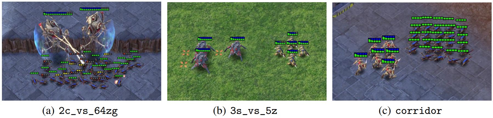

SMAC 基准测试
==========================

场景
--------------------------

所测试的地图情况如下表所列：

+----------------+------------+----+-----+--------+------+-----+------------+------------+------+
| **Map**        | 2m_vs_1z   | 3m | 8m  | 1c3s5z | 2s3z | 25m | 5m_vs_6m   | 8m_vs_9m   | MMM2 |
+----------------+------------+----+-----+--------+------+-----+------------+------------+------+
| n_agents       | 2          | 3  | 8   | 9      | 5    | 25  | 5          | 8          | 10   |
+----------------+------------+----+-----+--------+------+-----+------------+------------+------+
| n_enemies      | 1          | 3  | 8   | 9      | 5    | 25  | 6          | 9          | 12   |
+----------------+------------+----+-----+--------+------+-----+------------+------------+------+
| episode_steps  | 150        | 60 | 120 | 180    | 120  | 150 | 70         | 120        | 180  |
+----------------+------------+----+-----+--------+------+-----+------------+------------+------+
| training_steps | 1M         | 1M | 1M  | 2M     | 2M   | 5M  | 10M        | 10M        | 10M  |
+----------------+------------+----+-----+--------+------+-----+------------+------------+------+

    
测试结果
--------------------------

.. image:: figures/fig_0_2m_vs_1z.png
    :height: 130px
.. image:: figures/fig_1_3m.png
    :height: 130px
.. image:: figures/fig_2_8m.png
    :height: 130px
.. image:: figures/fig_3_1c3s5z.png
    :height: 130px
.. image:: figures/fig_4_2s3z.png
    :height: 130px
.. image:: figures/fig_5_25m.png
    :height: 130px
.. image:: figures/fig_6_5m_vs_6m.png
    :height: 130px
.. image:: figures/fig_7_8m_vs_9m.png
    :height: 130px
.. image:: figures/fig_8_MMM2.png
    :height: 130px
